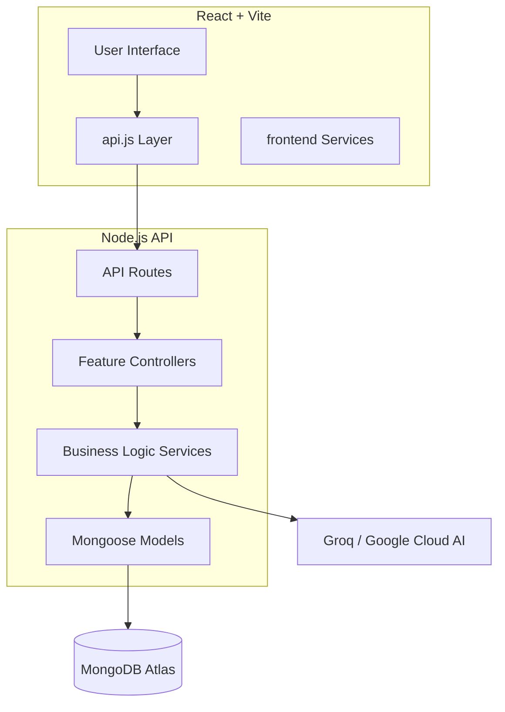

# 🚀 Music Discover: AI-Enhanced Music Discovery Platform

A professional, monorepo-structured full-stack application featuring AI-powered music recommendations, playlist intelligence, and personalized discovery.

---

## 🏗️ Project Architecture



## 🛠️ Tech Stack

- **frontend**: React 18, Vite, Tailwind CSS, Lucide React, Axios.
- **backend**: Node.js API, Mongoose, JWT, Helmet, Morgan.
- **AI**: Groq (Llama3), Google Cloud Platform features.
- **Storage**: ImageKit.io for media assets.

## 🚀 Getting Started

### Prerequisites

- Node.js >= 18.x
- MongoDB (Local or Atlas)
- Groq API Key

### Installation

1. **Clone the repository**:

   ```bash
   git clone <repo-url>
   cd MUSIC-DISCOVER
   ```

2. **Install Root Dependencies**:

   ```bash
   npm install
   ```

3. **Configure Environment**:
   - Copy `backend/.env.example` to `backend/.env`
   - Copy `frontend/.env.example` to `frontend/.env`
   - Fill in your API keys and configuration.

4. **Run in Development**:
   ```bash
   npm run dev
   ```

## 🛤️ API Endpoints

### Auth

- `POST /api/auth/register` - Create a new account
- `POST /api/auth/login` - Authenticate user
- `GET /api/auth/me` - Get current session user

### AI

- `POST /api/ai/chat` - Interactive AI companion
- `GET /api/ai/recommendations` - Personalized music discovery

---

## 🧹 Maintenance & Best Practices

- **Separation of Concerns**: Business logic resides in `services/`, not `routes/`.
- **API Strategy**: Centralized Axios instance in `frontend/src/services/api.js`.
- **Constants**: Shared configurations in `backend/src/constants/`.
- **Deployment**: Configured for Vercel (frontend) and scalable backend environments.

---

_Built with ❤️ by [Sahil Yadav]_
